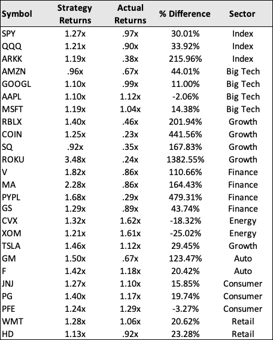

# Technical Analytics App

This is an interactive web application hosted on Streamlit that performs statistical analysis on public equities. The user inputs any ticker symbol and timeframe. The app builds a linear regression parallel channel and calculates key metrics to evaluate investment performance.

"stocks-ml.py" is the main program. 

"stocks.py" is the same less the algo-trading strategy backtesting.

[Live Application](https://share.streamlit.io/pac1226/stock-analytics-app/main/stocks-ml.py)


## Technologies

```python
The program uses Pandas, NumPy, FinancialAnalysis, Scikit-learn, hvPlot, Matplotlib, and sevaral custom built functions. 
```
---

## Installation Guide

FinancialAnalysis is required to run the Jupyter Notebook locally on your computer.

---

## Stock Assets

The application aggregates, cleans, and runs models on timeseries price data collected on any ticker symbol.

---

## Results

The algorithmic trading model was backtested with 25 stocks and outperformed a buy/hold strategy by 141%. It produced an average return of 41% across the 25 stocks over a one year period. A buy/hold strategy would've returned -12%. The algorithm performs better with high beta stocks and underperforms with energy stocks.

The algorithm bought a stock when its price dropped below the long-term trendline and sold it when the price rose above it. The buy/sell signals can be changed to optimize returns. For example, the buy signal can be set to "2 Standard Deviations (Below)" the mean and the sell signal to "1 Standard Deviation (Above)" the mean.

Returns were optimized by applying the Logistic Regression, Random Forest Classification, and Support Vector Machine algorithms. They all failed to outpeform the human-designed trading bot, but often outperformed the buy/hold strategy.

The following results are from 05/01/21 to 05/16/22.




---

## Usage

MIT License
